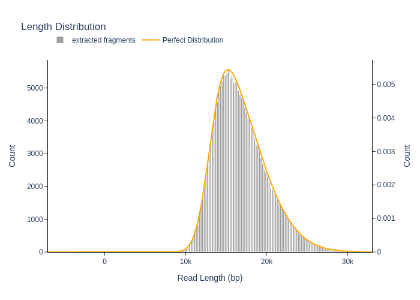

# SyntheticReads


## Simulating synthetic long-read datasets from multi-genome inputs


SyntheticReads (`SyntheticReads.py`) is a Python tool for generating **synthetic long-read sequencing datasets** from multiple reference genomes.  
It enables reproducible, coverage-driven simulation of long-read data with configurable read length distributions, sequencing error profiles, and support for circular genomes.

The tool is designed for **benchmarking genome assemblers, read mappers, and metagenomic analysis pipelines** using ground-truth datasets.

---

## Features

- Simulate long reads from **multiple FASTA references**
- **Coverage-driven** read generation (no fixed read count)
- Skew-normal read length distributions
- Per-read stochastic sequencing error rates
- Support for **circular and linear genomes**
- Outputs:
  - FASTA (sequences)
  - FASTQ (with Phred scores)
  - TSV metadata (origin, coordinates, error rates)
- Optional diagnostic plots for read length and quality distributions

---

## Requirements

Python ≥ 3.8

Required Python packages:
- `numpy`
- `scipy`
- `pandas`
- `biopython`
- `plotly`
- `tabulate`

You can install dependencies with:
```bash
pip install numpy scipy pandas biopython plotly tabulate
```


## Input Files

### 1. Reference genomes

A directory containing one or more FASTA (or multi-FASTA) files.

#### Example 1: 
Simple example for circularised and complete bacterial genomes and plasmid

```
genomes/
├── ecoli.fna
├── paeruginosa.fna
└── plasmid.fna
```

#### Example 2:
Simplified Eukaryotic + Bacterial community with nuclear genomes as multi-fasta files (sequence per chromosome), circularised organellar genomes and circularised bacterial genomes
In this example we compiled two algal genomes Pycnococcus, Dunaiella (nuclear, plastid, mitochondria), the heterotrophic protist Tetramitus (nuclear + mitochondria) and two bacteria E. coli and Pseudomonas.

```
genomes/
├── GCA_938743325.2_ucPycProv1.2_genomic_nuclear.fasta
├── ucPycProv1.2_mitochondrial.fasta
├── ucPycProv1.2_plastid.fasta
├── GCA_914767535.2_ucDunPrim2.2_genomic_nuclear.fasta
├── GCA_938743325.2_ucPycProv1.2_genomic_nuclear.fasta
├── ucDunPrim2.2_plastid.fasta
├── GCA_937625935.1_paTetJugo1.1_genomic_nuclear.fasta
├── paTetJugo1.1_mitochondrial.fasta
├── ecoli_GCA_000005845.2_ASM584v2_genomic.fasta
└── NC_002516.2_pseudomonas.fasta

```

### 2. TSV configuration file

A tab-delimited file specifying coverage depth and circularity for each reference.


#### Example 1:

Simple example for circularised and complete bacterial genomes and plasmid (`rel.ab.txt`):

```
fasta_file	coverage	is_circular
ecoli.fna	30	        True
paeruginosa.fna	10	    True
plasmid.fna	100	        True
```


#### Example 2:

```
fasta_file	coverage	is_circular
GCA_938743325.2_ucPycProv1.2_genomic_nuclear.fasta	30	0
ucPycProv1.2_mitochondrial.fasta	300	1
ucPycProv1.2_plastid.fasta	300	1
GCA_914767535.2_ucDunPrim2.2_genomic_nuclear.fasta	30	0
ucDunPrim2.2_mitochondrial.fasta	300	1
ucDunPrim2.2_plastid.fasta	300	1
GCA_937625935.1_paTetJugo1.1_genomic_nuclear.fasta	30	0
paTetJugo1.1_mitochondrial.fasta	300	1
ecoli_GCA_000005845.2_ASM584v2_genomic.fasta	100	1
NC_002516.2_pseudomonas.fasta	100	1
```

- coverage defines sequencing depth per reference
- is_circular should be True or False (or 0 and 1 for False and True, respectively)


## Usage

Basic example

```
python SyntheticReads.py \
  -i genomes \
  -o output \
  --tsv_file rel.ab.txt \
  --prefix synthetic_reads
```

---

## Parameters

| Parameter                      | Flag                       | Type   | Default    | Description                                                                             |
| ------------------------------ | -------------------------- | ------ | ---------- | --------------------------------------------------------------------------------------- |
| Input directory                | `-i`, `--input_directory`  | string | *required* | Path to directory containing FASTA or multi-FASTA reference genomes                     |
| Output directory               | `-o`, `--output_directory` | string | *required* | Directory where output files will be written                                            |
| TSV configuration file         | `--tsv_file`               | string | *required* | Tab-delimited file specifying input FASTA files, coverage values, and circularity flags |
| Output prefix                  | `--prefix`                 | string | `output`   | Prefix used for naming all generated output files                                       |
| Read length peak               | `--peak`                   | float  | `13000`    | Mode (peak) of the skew-normal read length distribution (in bp)                         |
| Read length standard deviation | `--std_dev`                | float  | `5000`     | Standard deviation of the read length distribution                                      |
| Read length skewness           | `--skewness`               | float  | `3.5`      | Skewness parameter controlling asymmetry of the read length distribution                |
| Mean error rate                | `--error_mean`             | float  | `0.001`    | Mean per-read sequencing error rate                                                     |
| Error rate standard deviation  | `--error_std_dev`          | float  | `0.0005`   | Standard deviation of the per-read error rate distribution                              |

Default values approximate PacBio HiFi–like reads.

---

## Coverage-driven read generation

The total number of reads is not specified by the user.

For each reference sequence of length L and target coverage C, the number of reads N is computed as:

    N = ceil((C × L) / μ)

where μ is the mean of the sampled read length distribution.

---

## Read length model

Read lengths are sampled from a skew-normal distribution parameterized by:
- peak (mode)
- standard deviation
- skewness

This allows modeling of asymmetric long-read length profiles typical of modern sequencing platforms.

---

## Error model

- Each read is assigned an independent error rate drawn from a normal distribution
- Errors are introduced as random base substitutions
- Error rates are clipped to the range [0, 1]
- FASTQ quality scores are computed as:

    Q = -10 × log10(error_rate)

- Quality scores are capped at Q50
- Each read receives a uniform per-base quality score

---

## Circular genome handling

For circular references:
- The sequence is internally duplicated
- Reads may span the origin of replication
- Coordinates are normalized to the original sequence length

Supported use cases include bacterial chromosomes, plasmids, and organellar genomes.

---

## Output Files

For a given prefix <prefix>:

- prefix.*.generated_reads.fasta
- prefix.*.generated_reads.fastq
- prefix.*.generated_reads.tsv

The TSV file records:
- Read ID
- Source FASTA
- Contig ID
- Read length
- Start and end positions
- Error rate
- Q-score

---

## Example: ONT-like simulation

```
    python SyntheticReads.py \
      -i genomes \
      -o output \
      --tsv_file rel.ab.txt \
      --prefix ont_sim \
      --peak 10000 \
      --std_dev 30000 \
      --skewness 20 \
      --error_mean 0.01 \
      --error_std_dev 0.05
```

## Suggested settings for ONT vs PacBio

### PacBio HiFi–like
- peak: 13000
- std_dev: 5000
- skewness: 3.5
- error_mean: 0.001

### Oxford Nanopore–like
- peak: 10000
- std_dev: 30000
- skewness: 20
- error_mean: 0.01

---

## Example read length distribution



---


## Citation

If you use SyntheticReads in academic work, please cite the repository as follows:

    @software{syntheticreads,
      author       = {De Boever, Frederik},
      title        = {SyntheticReads: Coverage-driven simulation of long-read sequencing data},
      year         = {2026},
      url          = {https://github.com/FDBoever/SyntheticReads},
      version      = {v1.0.0}
    }


